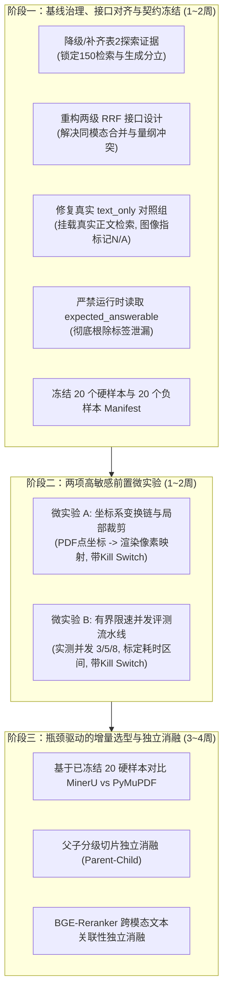

# Conflux-Weave 多模态 RAG 严谨评测治理与增量消融实施方案

- **编制日期**：2026-09-20
- **文档状态**：`revised-v2`，采纳第二轮评审意见全面修订
- **核心定位**：从“宽泛的技术候选清单”收敛为**“可归因、可复现、零Mock、带分层指标契约与退出条件”**的严谨工程实施方案。
- **诊断基线**：`main` 分支真实物理底座（10 篇真实 arXiv 论文、56 幅物理图表、150 例物理标注测试集、LanceDB 向量索引、`jina-clip-v2` 1024 维向量）。

> **【最高实验红线】严禁使用任何模拟数据（Mock Data）、合成数据（Synthetic Data）或预置命中（Mocked Hits）**：  
> 所有评测必须 100% 建立在从真实物理 PDF 中提取的资产、真实的 LanceDB 物理向量表、真实的论文正文文本检索、以及真实的在线 VLM 推理调用之上。凡涉及基线看板的数据，必须具备代码执行产生且不可篡改的日志、请求响应与审计产物。

---

## 1. 核心评审意见与自我诊断复盘

结合两轮严格自查与架构评审，梳理出必须全数纠正的关键问题：

### 1.1 基线混用与可审计证据缺失（Evidence Auditability）
- **事实暴露**：当前工作树中的 [multimodal_baseline_v2_report.json](file:///d:/code/Conflux-Weave/var/evaluations/multimodal_baseline_v2_report.json) 产生于 `--skip-generation` 模式。其 150 例数据仅能证明**全量物理检索指标（Recall@5=0.90, MRR=0.82）**。而此前记录的 `18.5s / 0.75 / 0.88 / 0.84` 等生成数据仅属于**早期探索性小样本抽样**，工作树中缺失对应的独立 JSONL、manifest、样本 ID、原始输入输出与时间戳归档。
- **治理原则**：
  1. 严格将表 2 定位为**“历史抽样探索参考值（审计归档证据待补）”**，不得列为当前正式基线；
  2. 后续任何正式生成基线必须生成独立的可审计产物包（包含 `manifest.json`、完整 Prompt、原始 Response、Token 消耗、延迟与成本）。

### 1.2 对照组失效与运行时标签泄漏（Control Breakdown & Runtime Leakage）
- **`text_only` 对照组伪失效**：此前 `run_multimodal_benchmark_v2.py` 的 `text_only` 条件直接返回 `[]` 空列表，并提示模型“未找到图表，请拒答”。这并非真正的纯文本 RAG 对照，人为制造了纯文本的失败。**必须接入真实论文正文文本切片检索**，让模型凭正文段落回答。
- **运行时标签泄漏（Runtime Label Leakage）**：`generate_physical_answer` 中存在读取 `case.expected_answerable` 来分支处理缓存键和失败兜底的逻辑。`expected_answerable` 只能作为评测器（Evaluator）计算金标准的 ground-truth 依据，**严禁进入运行时生成函数、缓存键、Prompt 拼接或失败兜底逻辑**。
- **RRF 契约与量纲冲突**：现有 `multimodal_reciprocal_rank_fusion` 的类型契约是 `(text_hits: Sequence[RetrievalHit], image_hits: Sequence[MultimodalRetrievalHit])`，此前方案把 `cap_hits` 作为 `text_hits`、`vec_hits` 作为 `image_hits`，语义上将题注图片命中错判为文本命中。此外，`score_threshold=0.15` 无法兼容向量相似度（[-1, 1]）、词法打分（[2, 15]）与 RRF 打分（[0.01, 0.05]）三种完全不同的量纲。

### 1.3 `text_only` 指标契约错配
- 纯文本对照组不产生图片输出，若直接在图像 `Recall@1/3/5`、BBox 定位准确率和图像证据闭环率上记为 `0.00`，会误将“设计上无图片”当成“检索能力归零”。**必须对指标体系按层级解耦，非多模态指标显式标记为 `N/A`**。

### 1.4 暗坑与选型跨度治理
- **坐标系暗坑**：`crop_asset_bbox` 处理图片像素，而 `asset.bbox` 属于 PDF 页面点（72 DPI）。未经验证的直接裁剪会导致错位截断。“节省 50% Token”必须建立在坐标系换算验证之后。
- **并发耗时务实测算**：450 次带有大图的 VLM 请求，即便并发 5~8，在计入网络波动、限流退避和超时重试后，理想时间约为 **15～35 分钟**，“12 分钟”不可作为排期假设。
- **样本冻结与单一变量归因**：20 个排版硬样本和 20 个近领域负样本必须预先冻结 ID 与规则，严禁事后挑样本。所有技术选型以单一变量消融为准，指标承诺降级为可证伪假设。

---

## 2. 实施顺序调整：增量消融三阶段路线图



---

## 3. 阶段一：基线规范化、接口对齐与契约冻结

### 3.1 分立基线看板规范与审计协议

#### 表 1：全量物理检索基线（当前工作树实测，N=150：120 正向 + 30 领域外负向）
*数据来源：[var/evaluations/multimodal_baseline_v2_report.json](file:///d:/code/Conflux-Weave/var/evaluations/multimodal_baseline_v2_report.json)（`--skip-generation` 模式实测）*

| 实验条件 | Recall@1 | Recall@3 | Recall@5 | MRR | nDCG@5 | 物理定位率 | 证据闭环率 | 负样本假阳率 (FPR) |
| :--- | :---: | :---: | :---: | :---: | :---: | :---: | :---: | :---: |
| **`joint_embedding`** | **0.77** | **0.88** | **0.90** | **0.82** | **0.84** | **1.00** | **1.00** | **0.00** |
| `caption_baseline` | 0.72 | 0.81 | 0.82 | 0.77 | 0.78 | 1.00 | 1.00 | 0.00 |
| `text_only` (待改造) | N/A | N/A | N/A | N/A | N/A | N/A | N/A | 0.00 |

#### 表 2：端到端物理生成基线（历史抽样探索参考值，完整审计归档待生成）
*数据说明：此表仅作为前期在 10 个用例抽样上打通 VLM 链路的探索性参考值，当前工作树缺少对应的原始 Response 与审计包，不得直接视作当前正式基线。*

| 实验条件 | 抽样用例数 (N) | 运行状态 | 事实忠实度 (参考) | 引用精准率 (参考) | 拒答正确率 (参考) | 综合效用 (参考) |
| :--- | :---: | :---: | :---: | :---: | :---: | :---: |
| **`joint_embedding`** | 10 | 历史抽样探索 | 0.75 | 0.88 | 1.00 | 0.84 |
| `caption_baseline` | 10 | 历史抽样探索 | 0.61 | 0.88 | 1.00 | 0.70 |
| `text_only` | 10 | 历史伪对照 | 0.34 (假失败) | 0.88 | 1.00 | 0.27 |

> **正式生成基线的审计产物规范（必须落地保存）**：
> 运行正式生成基线时，必须输出并在 `var/evaluations/` 下沉淀独立产物：
> 1. `run_meta.json`：记录 Git Commit、Timestamp、Provider、Model、Temperature、Max Tokens、Retry Policy；
> 2. `cases_evaluated.jsonl`：包含评测样本 ID、Query、检索命中的完整元数据；
> 3. `raw_responses.jsonl`：包含模型原始响应文本、每轮生成的 Latency (ms)、Input Tokens、Output Tokens 与费用；
> 4. `metrics_scorecard.json`：分层度量结果。

---

### 3.2 `text_only` 对照组真实化与分层指标契约

为彻底解决把“无图片输出”误判为“能力为零”的问题，将指标体系严格解耦为三个层级：

```
┌────────────────────────────────────────────────────────────────────────┐
│                        多模态评测三层指标契约体系                      │
├────────────────────────────────────────────────────────────────────────┤
│ 【1. 通用检索层】 (面向文本/段落)                                      │
│  - Text Recall@K (正文段落召回率)                                      │
│  - Text MRR (正文段落平均倒数排名)                                     │
│  - Referencing Chunk Hit Rate (图表引用关键段落命中率)                 │
├────────────────────────────────────────────────────────────────────────┤
│ 【2. 生成与推理层】 (面向回答内容本身)                                 │
│  - Factuality Score (事实忠实度：与 Ground Truth 事实点匹配率)         │
│  - Citation Precision (引用精准率：有效引用标记占比)                   │
│  - Rejection Rate (拒答正确率：对无依据问题的判定准确率)               │
│  - Latency & Cost (单次推理端到端耗时与 Token 成本)                    │
├────────────────────────────────────────────────────────────────────────┤
│ 【3. 多模态专属层】 (仅当包含视觉分支时适用)                           │
│  - Image Recall@1/3/5 (目标物理图表召回率)                             │
│  - Image MRR & nDCG@5 (图表排序精度)                                   │
│  - Localization Accuracy (IoU >= 0.5 物理定位准确率)                   │
│  - Visual Evidence Closure (图片引用闭环率)                            │
└────────────────────────────────────────────────────────────────────────┘
```

#### 对照组执行契约：
- **`text_only` 条件**：
  - 检索阶段：对论文正文切片库执行检索，返回 Top-5 最相关正文 Chunk；
  - 指标记分：**多模态专属层的所有指标（Image Recall/MRR/BBox/闭环率）一律记为 `N/A`**，严禁记为 0.00；
  - 生成阶段：模型仅阅读检索到的正文 Chunk 解答问题，衡量纯文本事实忠实度；
- **`joint_embedding` 条件**：
  - 拥有完整的文字检索、图片检索与多模态生成，三层指标全部参与考核。

---

### 3.3 严禁运行时读取 `expected_answerable`（Zero Runtime Leakage）

建立严格的权限隔离协议：

```
[评测金标准 / Ground Truth] ────────► [评测评估器 Evaluator] ──► 计算 FPR / 拒答率
         │ (expected_answerable)               ▲
         │                                     │
   【物理阻断】                                │ (模型生成的真实文本)
         │                                     │
         ▼                                     │
[运行时流程 Runtime / Runner] ─────────────────┴
  Query ──► 物理检索 ──► (仅凭检索置信度判定) ──► 提示工程 ──► VLM 推理生成
```

1. **生成函数入参清洗**：`generate_physical_answer` 签名彻底废除 `expected_answerable`；
2. **缓存键重构**：缓存键仅由 `condition + case_id + top_hit_id` 组成，严禁注入 `unanswerable::` 前缀；
3. **提示词中立化**：
   - 检索置信度低（Top-1 score $< 0.30$）时，仅提示：“文献库检索置信度较低，请审慎核对，若缺乏事实依据请明确陈述”；
   - 严禁出现“文献库中不存在此项内容，请指出不存在”等直接剧透答案的引导语；
   - 模型是否拒答，完全取决于其对检索上下文的理解与内在判断。

---

### 3.4 两级 RRF 接口设计（解决同模态合并与量纲冲突）

为彻底解决同模态图片流混杂与多模态量纲冲突的问题，放弃单次混乱调用，重构为**“图片内部多流融合 + 图文跨模态融合”的两级架构**：

#### 第一级：图片内部多路候选融合（Intra-Modal Image RRF）
将 `vec_hits`（向量流，余弦相似度）与 `cap_hits`（题注/OCR流，BM25 词法分）在图片候选空间做纯排名的 RRF 融合：
```python
def intra_modal_image_rrf(
    vector_hits: Sequence[MultimodalRetrievalHit],
    caption_hits: Sequence[MultimodalRetrievalHit],
    *,
    k: int = 60,
    top_k: int = 10,
) -> tuple[MultimodalRetrievalHit, ...]:
    """仅基于排位 (Rank) 融合多路图片候选，完全绕过余弦与 BM25 的绝对量纲差异。"""
    rrf_scores: dict[str, float] = {}
    best_hit: dict[str, MultimodalRetrievalHit] = {}

    for rank, h in enumerate(vector_hits, 1):
        rrf_scores[h.asset_id] = rrf_scores.get(h.asset_id, 0.0) + 1.0 / (k + rank)
        best_hit[h.asset_id] = h

    for rank, h in enumerate(caption_hits, 1):
        rrf_scores[h.asset_id] = rrf_scores.get(h.asset_id, 0.0) + 1.0 / (k + rank)
        if h.asset_id not in best_hit or not best_hit[h.asset_id].caption:
            best_hit[h.asset_id] = h

    sorted_ids = sorted(rrf_scores.keys(), key=lambda aid: rrf_scores[aid], reverse=True)
    fused_image_hits = []
    for rank, aid in enumerate(sorted_ids[:top_k], 1):
        h = best_hit[aid]
        fused_image_hits.append(
            MultimodalRetrievalHit(
                asset_id=h.asset_id,
                score=rrf_scores[aid],  # 归一化的 RRF 分数
                rank=rank,
                modality="image",
                document_id=h.document_id,
                page=h.page,
                bbox=h.bbox,
                coordinate_space=h.coordinate_space,
                parent_chunk_ids=h.parent_chunk_ids,
                caption=h.caption,
                artifact_ref=h.artifact_ref,
                thumbnail_artifact_ref=h.thumbnail_artifact_ref,
                embedding_model=h.embedding_model,
                index_version=h.index_version,
                locator=h.locator,
                referencing_text=h.referencing_text,
                ocr_text=h.ocr_text,
            )
        )
    return tuple(fused_image_hits)
```

#### 第二级：图文跨模态融合（Cross-Modal RRF）
使用原生的 `multimodal_reciprocal_rank_fusion`，以真实的 `RetrievalHit`（文本切片）与一级融合产生的 `MultimodalRetrievalHit`（融合图片）进行融合，各模态独立配置过滤门槛。

---

## 4. 阶段二：两项高敏感前置微实验方案

### 4.1 微实验 A：坐标系变换链与安全局部裁剪

#### 1. 核心风险
- PDF 页面点坐标（72 DPI）与已提取图片像素存在缩放比例 $S$；
- 页面旋转（0°, 90°, 180°, 270°）会导致 $(x, y)$ 轴向置换；
- 错误裁剪会导致图例或关键坐标轴被“一刀切断”。

#### 2. 变换链数学推导与映射协议
```
PDF 页面点坐标 [x_pt, y_pt, w_pt, h_pt]
     │
     ▼  × (DPI / 72.0)
整页渲染位图像素 [x_px, y_px, w_px, h_px]
     │
     ▼  - [asset_origin_x, asset_origin_y]
资产图内部相对像素 [x_rel, y_rel, w_rel, h_rel]
     │
     ▼  + 5% 安全裕量 (Safe Margin)
最终局部裁剪视窗 (Valid Crop Box)
```

#### 3. 实验设置与退出条件
- **实验集**：从 120 个正向案例中预先冻结 10 个含子图复合资产（如 `Figure 4(a/b/c)`）；
- **度量**：裁剪准确率（IoU）、关键文字留存率、Token 消耗减少百分比；
- **【退出条件 (Kill Switch)】**：若坐标变换导致图表坐标轴或标题截断率 $> 5\%$，或者实测 Token 节省低于 $25\%$，暂停推全，退回全图输入。

---

### 4.2 微实验 B：有界限速并发评测流水线

#### 1. 核心风险
- 450 次请求若无控并发，会引发服务商 429 限流并触发级联重试；
- 盲目设定并发度可能导致网络 I/O 阻塞或单机内存 OOM。

#### 2. 实验方案与耗时模型
1. **实现带限流退避的并发器**：
   - 基于 `asyncio.Semaphore(max_concurrency)`；
   - 捕获 429/503 时触发 Jitter 随机抖动的指数退避（$2^k + \text{rand}(0, 1)$ 秒）；
   - 写入 `eval_checkpoint.jsonl`，实现单例级别的断点续评。
2. **阶梯压测与耗时拟合**：
   - 在 20 个案例上测试 $C = 1, 3, 5, 8$ 并发度；
   - 实测统计单次请求真实延迟分布（P50, P90, P99）与 429 报错频次；
   - 拟合 450 次请求的真实测算耗时区间：
     $$\text{Total Time} \approx \frac{450 \times \text{P50\_Latency}}{C} \times (1 + \text{Retry\_Rate}) + \text{Network\_Buffer}$$
3. **【退出条件 (Kill Switch)】**：
   - 若并发度 $> 3$ 时 API 429 错误率超过 $10\%$，强制将默认并发度锁定为 3，以稳定性为第一优先级。

---

## 5. 阶段三：瓶颈驱动的增量选型与独立消融

### 5.1 提前冻结的消融样本集协议（避免事后挑样本）

在进入选型实验前，必须在代码库中固化两个固定子集的 `manifest.json`：
1. **20 例排版/表格硬样本（Hard Subset）**：
   - 挑选规则：全量检索中命中但在 Top-3 以外，或存在双栏换行穿透、跨页截断的真实论文案例；
   - 固化资产 ID 与页面，生成 SHA-256 校验码；
2. **20 例近领域干扰负样本（Near-Domain Negatives）**：
   - 挑选规则：正文中提及某项技术名称（如“ResNet”、“Transformer 架构”），但论文中完全未配对应图表的真实问题，专门考核语义相近时的防误召回能力。

---

### 5.2 独立消融课题规划与退出条件

| 消融课题 | 单一变量设置 | 检验假设 (可证伪命题) | 退出门槛 (Kill Switch) |
| :--- | :--- | :--- | :--- |
| **课题 1：MinerU 孤立消融** | 仅替换 20 个硬样本的解析器，下游检索与模型全部冻结 | 假设“MinerU 在 20 个排版硬样本上的表格拓扑匹配率 (TEDS) 相比 PyMuPDF 提升 $\ge 25\%$” | 若下游检索召回改善 $< 5\%$ 或单页解析耗时 $> 5\text{s}$，**放弃全局替换** |
| **课题 2：父子切片架构消融** | 保持文本与向量模型不变，仅对比单层切片与 Parent-Child | 假设“父子切片使长篇学术推导的事实忠实度相对提升 $\ge 10\%$” | 若 Token 开销增加 $> 50\%$ 且事实性无显著提升，**放弃回溯分级** |
| **课题 3：BGE-Reranker 跨模态文本消融** | 保持粗排不变，仅对比启发式规则与 Cross-Encoder | 假设“Cross-Encoder 在 20 个近领域干扰负样本上的拦截率提升 $\ge 20\%$” | 若单 Query 延迟增加 $> 500\text{ms}$ 且近领域 FPR 改善 $< 5\%$，**保持轻量规则** |

---

## 6. 阶段一验收标准与立即执行任务

进入后续工作前，必须先完成以下两个核心验收点：

### 验收点 1：表 2 证据治理与可审计基线规范
- [x] 表 2 在方案中已明确标注为“历史抽样探索参考值，完整审计归档待生成”；
- [ ] 改造评测 runner，支持导出符合 3.1 节规范的完整生成审计产物包（包含参数、原始输入输出、Token 与耗时）。

### 验收点 2：RRF 接口重构与三层分层指标契约
- [ ] 实现 `intra_modal_image_rrf`（图片内部多流排位融合），理顺与跨模态 RRF 的分工；
- [ ] 重构评测统计模块，将 `text_only` 的多模态专属指标显式输出为 `N/A`，接入真实文本切片检索；
- [ ] 彻底清除运行时读取 `expected_answerable` 的标签泄漏。
